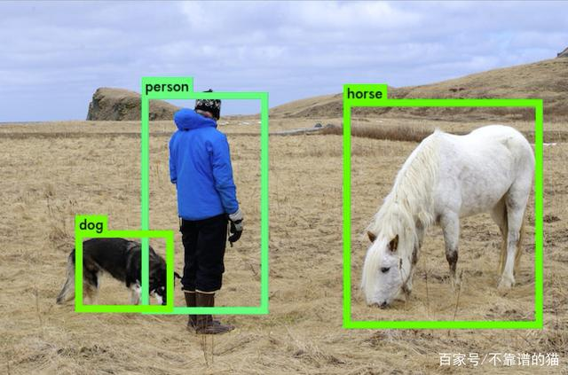
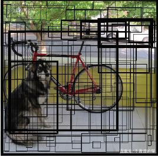
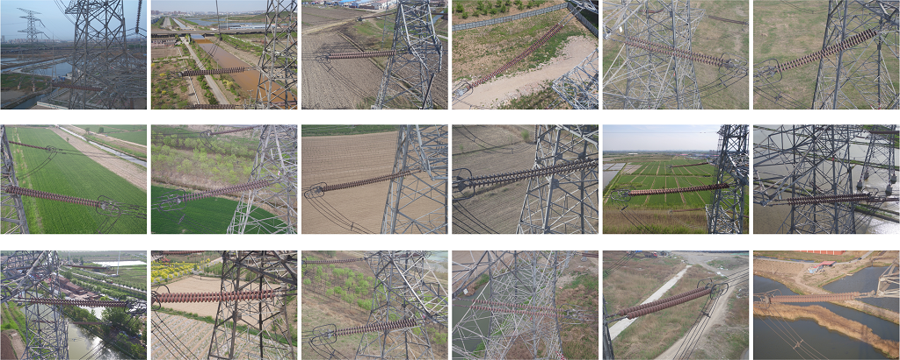
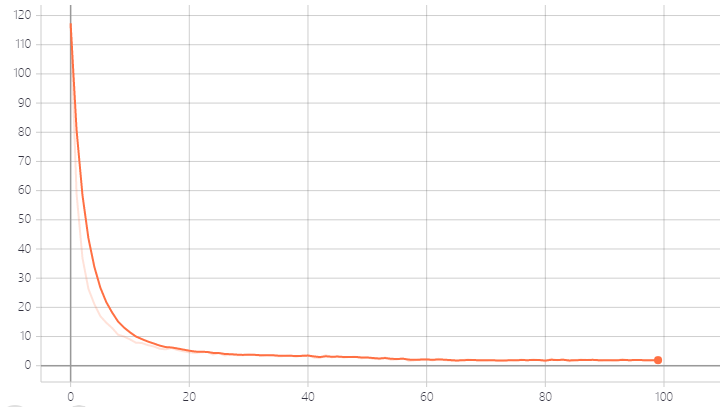

# YoloV4_Insulators

### 一、项目简介

Yolo_Insulators是一个基于YoloV4的绝缘子目标检测程序.
**依赖**：

- Python3.6
- Pytorch1.2.0
- CUDA10.0

### 二、Yolo算法简介

“You Only Look Once”或“YOLO”是一个对象检测算法的名字，这是Redmon等人在2016年的一篇研究论文中命名的。YOLO实现了自动驾驶汽车等前沿技术中使用的实时对象检测。让我们看看是什么使该算法如此受欢迎，并概述其工作原理。



#### 1、背景

**实时的重要性**

人们看到图像以后，可以立即识别其中的对象、它们的位置和相对位置。这使得我们能够在几乎无意识的情况下完成复杂的任务，比如开车。因此，对汽车进行自动驾驶训练需要类似水平的反应能力和准确性。在其最基本的形式中，这样的系统必须能够分析实时视频中的道路，并能够在继续确定路径之前检测各种类型的对象及其在现实世界中的位置，所有这些都必须是实时的。

**在YOLO之前**

先前的检测系统使用分类器对测试图像的不同切片进行评估。例如，Deformable Parts Model (DPM)涉及到在图像中均匀间隔的位置上滑动窗口并在这些部件上运行分类器。R-CNN(Region-based Convolutional Neural Networks)是另一种模型，它运行一种分割算法将一幅图像分割成一个个小块，然后在这些小块上运行一个分类器。但是，速度慢、优化困难一直困扰着这种YOLO之前的系统。

#### 2、YOLO算法

YOLO将对象检测重新定义为一个回归问题。它将单个卷积神经网络(CNN)应用于整个图像，将图像分成网格，并预测每个网格的类概率和边界框。例如，以一个100x100的图像为例。我们把它分成网格，比如7x7。


然后，对于每个网格，网络都会预测一个边界框和与每个类别（汽车，行人，交通信号灯等）相对应的概率。



每个边界框可以使用四个描述符进行描述：

边界框的中心高度宽度值映射到对象所属的类

此外，该算法还可以预测边界框中存在对象的概率。如果一个对象的中心落在一个网格单元中，则该网格单元负责检测该对象。每个网格中将有多个边界框。在训练时，我们希望每个对象只有一个边界框。因此，我们根据哪个Box与ground truth box的重叠度最高，从而分配一个Box来负责预测对象。

最后，我们对每个类的对象应用一个称为“非最大抑制（Non Max Suppression）”的方法来过滤出“置信度”小于阈值的边界框。这为我们提供了图像预测。


#### 3、重要性

YOLO非常快。由于检测问题是一个回归问题，所以不需要复杂的管道。它比“R-CNN”快1000倍，比“Fast R-CNN”快100倍。它能够处理实时视频流，延迟小于25毫秒。它的精度是以前实时系统的两倍多。同样重要的是，YOLO遵循的是“端到端深度学习”的实践。

### 三、代码说明

#### 1、文件结构

```
.
│  predict.py				# 对图片进行预测
│  train.py					# 训练模型
│  voc_annotation.py		# 对VOC数据集处理导出索引
│  yolo.py					# 预测程序的子程序
│  
├─img						# 存放预测后的图像
├─logs						# 存放训练的模型文件
├─model_data				# 存放预训练模型
│      new_classes.txt		# 类别的名称
│      yolo_anchors.txt		# 先验框的大小
│      
├─nets						# 网络结构
│      CSPdarknet.py		# CSPdarkNet53主干特征网络
│      yolo4.py				# FPN、SPP等网络
│      yolo_training.py		# 模型训练子程序
│      
├─utils						# 数据加载、NMS等
│      dataloader.py		# 数据加载
│      utils.py				# 数据处理、增强等
│      
└─VOCdevkit					# VOC数据集
    └─VOC2007
        │  voc2yolo4.py		# 数据集转换
        │  
        ├─Annotations		# 标注XML文件
        ├─ImageSets
        │  └─Main
        └─JPEGImages		# 数据集图片
```

#### 2、基本原理

YoloV4基本网络结构如下：


YoloV4整个网络主要分为CSPDarknet53、SPP、PANet和Yolo Head四个部分。

**CSPDarknet53**：主干特征提取网络，主要利用深度卷积提取图像特征，便于后续网络使用。代码主要在`nets\CSPdarknet.py`下，以下为CSPDarknet53网络结构的类。

```python
class CSPDarkNet(nn.Module)
```

在`forward`部分可以看到输入图像经过一次普通卷积和五次残差卷积，最后将倒数三层结果输出，供给后面网络使用。这样可以提取不同尺度的特征信息，方便后续的特征融合及提取。值得注意的是

**SPP**：加强特征提取网络的一部分，主要是使用不同池化核进行最大池化，再进行多重感受野融合。以下为SPP网络部分的类。

```python
class SpatialPyramidPooling(nn.Module)
```

采用三种不同的池化核对输入特征层池化，得到不同感受野的特征层，最后融合所有输出层及输入层实现多重感受野的融合。

**PANet+Yolo Head**：加强特征提取网络的一部分和网络输出，主要对上两个网络输出的不同尺度的特征进行上下采样特征融合，最后在三种不同的尺度上对预测的结果输出，以下为PANet和YoloHead的类。

```python
class YoloBody(nn.Module)
```

输入的`x2`,`x1`,`x0`为`CSPDarknet53`和`SPP`网络的输出，分别代表着三个不同尺度的特征层，在`PANet`中将这三个不同尺度的特征通过上下采样，使其在大小上具有相同的尺度，再进行特征融合，依次在三个不同尺度下进行，最后通过卷积将结果输出，值得注意的是yolo的输出既包含回归也包含分类，其中在不同物体识别上是采用分类的方式，在预测物体所在位置时采用回归的方式。

### 四，如何使用

#### 1、数据集

数据集采用网上开源的绝缘子数据集，共600张图片。数据集格式使用VOC2007，标注文件为xml。

你可以通过百度网盘来下载[绝缘子数据集-提取码：djuf ](https://pan.baidu.com/s/1z_J9tx-151FFAVW9ASJz9A )，以下是部分数据集图片。



若需要扩增自己的数据，可以使用[labelimg](https://github.com/tzutalin/labelImg)来标注新的数据，注意标签为insulator。

**如何制作数据集**

将数据集图片存放至`VOCdevkit/VOC2007/JPEGImages`目录，再将标注文件放至`VOCdevkit/VOC2007/Anootations`目录。

执行

```
python VOCdevkit/VOC2007/voc2yolo4.py
python voc_annotation.py
```

运行成功后会在`VOCdevkit/VOC2007/ImageSets/Main`目录生成训练需要的文件。

#### 2、训练模型

由于数据集数量较小，直接训练模型收敛效果可能不佳，达不到高识别率。绝缘子识别是目标检测的一个子应用，其模型的很多参数与其他目标检测的参数相似，因此可以通过一个在完备的数据集上训练好的模型通过迁移学习应用到绝缘子识别上，可以在数据集较小的情况下使模型快速收敛，实现更高的准确率。

迁移学习策略：先冻结CSPDarknet53网络， 只训练FPN部分，后期再将CSPDarknet53解冻，在全网络上训练模型。

在`train.py`中可以通过设置`Cosine_lr`、`mosaic`和`smoooth_label`来设置是否采用余弦退火策略、mosaic数据增强和标签平滑等。训练集和验证集默认比例为9:1，可在`train.py`文件中修改`val_split`参数来调整比例。同时也可以调整参数`lr`、`Batch_size`、`Epoch`来修改学习率、批大小及迭代次数。

训练模型只需运行

```
python train.py
```

训练好的模型会存在`log`文件下。

你可以通过百度网盘来下载我已经训练好的[模型-提取码：t9ct](https://pan.baidu.com/s/1bGBd9821KCpcgOTRuHQseg)，以下是训练模型loss的变化，



#### 3、测试模型

若使用自己训练的模型，需要在根目录的`yolo.py`中修改`model_path`的路径。不过也可以使用这里训练好的[模型-提取码：t9ct](https://pan.baidu.com/s/1bGBd9821KCpcgOTRuHQseg)，下载模型后将模型文件放入`logs`文件夹即可。在`predict.py`中修改`imgPath`为需要预测的图片路径，运行

```
python predict.py
```

即可弹出预测成功的窗口，并将预测的结果存放至`img`文件夹中。

以下为我训练的模型的部分测试结果。


